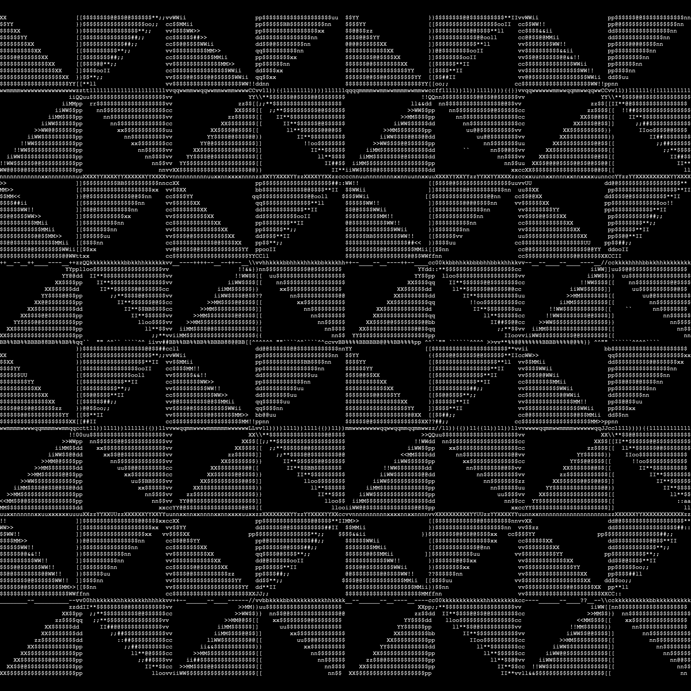

# C++ Playground

As the name indicates, this is a place for me to play around with C++. Historically, I've used [Processing](https://processing.org/) and [p5.js](https://p5js.org/reference/) for this sort of stuff, but wanted to try things out in C/C++.

## jpg2ascii (C)

A simple utility that takes a JPEG image and outputs the equivalent in ASCII art. Demos below:

| Test Image                                  | ASCII Image                                 |
|---------------------------------------------|---------------------------------------------|
|      |  |
|      |  |
|      |  |
|      |  |

There are two levels of detail (more mapped characters per level), which you can see above.

## Raylib (C++)

I used C++ bindings for [Raylib](https://github.com/RobLoach/raylib-cpp) to produce a moderately advanced fireworks
simulation, making use of Euler integration to approximate particle behavior.

To try out web support, I used empscripten to compile the C++ to WASM. The
[out-of-the-box results](https://matiasilva.github.io/cpp-playground/) were promising.

## SFML (C++)

### Falling sand simulation

### Rotating rainbow wheel

